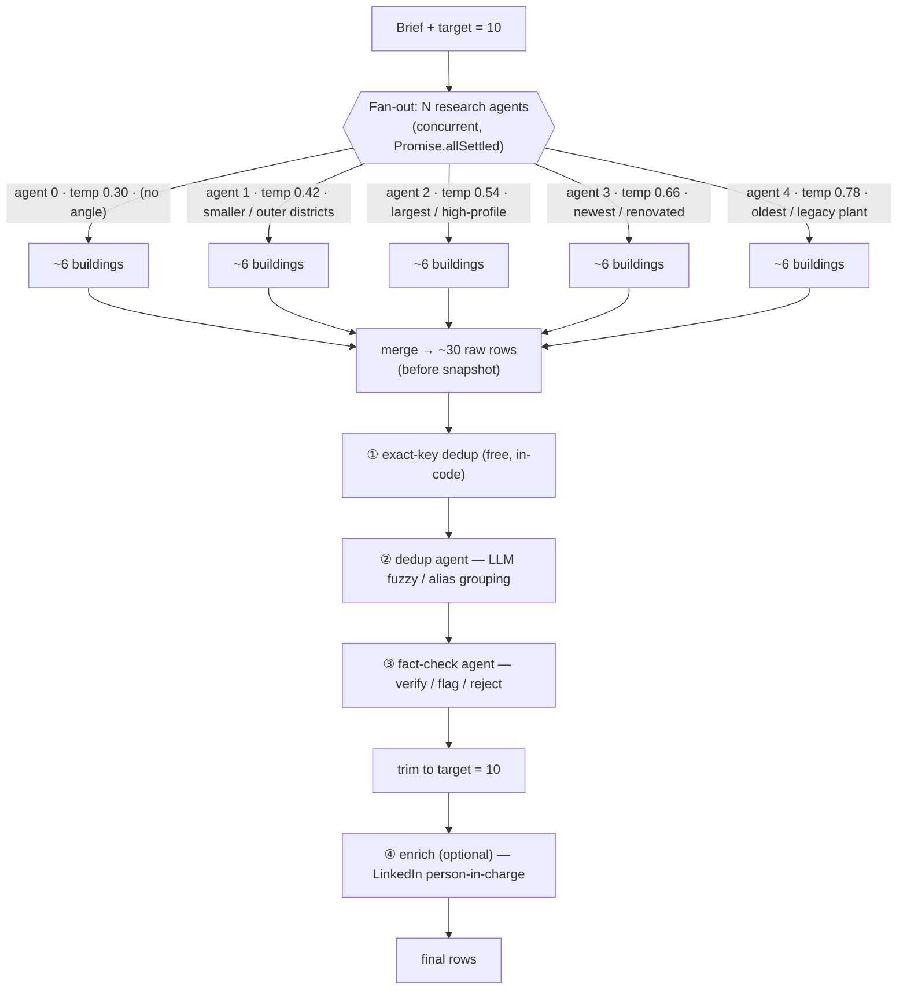
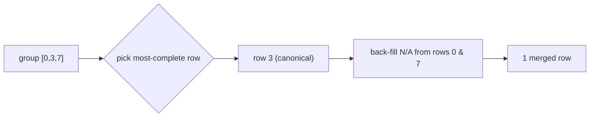

# How the research agents search, overlap, and get deduped

*Scope: the multi-agent path in `runMultiAgentResearch` (`lib/agents.ts:247`). This is the
"fan-out → funnel" pipeline the UI uses when **Verify** + **model panel** are on.*

---

## TL;DR — why "10 target → 6 raw → 5 verified" happens

All N research agents run the **same brief** on the **same area**, nudged apart only by a
one-line angle + a temperature bump. For a well-known place they converge on the same landmark
buildings, so the dedup agent folds most of the pile away. The verified count you ship is close
to **what a single agent would have produced** — the extra agents mostly buy robustness (one can
fail without sinking the run) and a little long-tail coverage, **not** proportionally more rows.

> **Rule of thumb:** unique buildings ≈ *coverage of the area*, not *number of agents*.
> 5 agents on one brief ≠ 5× the buildings. It's ~1× the buildings, found 5 ways.

If you want more *distinct* rows, widen the **search space** (split by district / sector), don't
add more agents on the same brief. See [§6](#6-is-5-agents-worth-it).

---

## 1. Topology



Two review agents are **sequential gates** the combined pile flows through once — this is *not*
the older `runResearchLoop` topology (one researcher looped over rounds). Here the researchers
run in **parallel** and the reviewers run **after** the merge.

---

## 2. How the agents are pulled apart (diversification)

Each agent gets the **identical brief** plus two knobs (`lib/agents.ts:271-284`):

| Agent | Temperature | Angle (`ANGLES`, `lib/agents.ts:190`) |
|------:|:-----------:|----------------------------------------|
| 0 | 0.30 | *(none)* |
| 1 | 0.42 | Favour less-obvious / smaller candidates and outer sub-districts. |
| 2 | 0.54 | Favour the largest, highest-profile candidates first. |
| 3 | 0.66 | Favour newer / recently-renovated candidates. |
| 4 | 0.78 | Favour older, established candidates on legacy central plant. |

**Why this is weak for a known city:** the angle is a *suggestion inside one prompt*, not a hard
partition of the search space. Nothing stops agent 1 ("smaller/outer") from also returning KLCC.
Temperature only reorders/re-samples the same popularity-ranked candidate set — it doesn't send
agents to different districts. So overlap stays high.

---

## 3. Where the overlap comes from (illustrative)

Five agents, one brief = "top chilled-water buildings in KL". A realistic raw union looks like:

| Building (raw)         | A0 | A1 | A2 | A3 | A4 | copies |
|------------------------|:--:|:--:|:--:|:--:|:--:|:-----:|
| KLCC / Suria KLCC      | ✅ | ✅ | ✅ | ✅ | ✅ | 5 |
| Pavilion KL            | ✅ | ✅ | ✅ | ✅ |    | 4 |
| Exchange 106 (TRX)     | ✅ |    | ✅ | ✅ | ✅ | 4 |
| Merdeka 118            |    |    | ✅ | ✅ |    | 2 |
| Mid Valley Megamall    | ✅ | ✅ |    |    | ✅ | 3 |
| Menara Maybank (old)   |    |    |    |    | ✅ | 1 |
| Wisma outer-district X |    | ✅ |    |    |    | 1 |

~30 raw rows → **~6–8 unique** once aliases collapse. The famous ones appear 4–5×; only the
low-temperature / angled agents contribute the rare singletons. That ratio (≈70–75% duplicates)
matches your run and the last logged trace (`rawTotal 29 → afterDedup 8`).

---

## 4. The dedup logic — 3 layers, cheapest first

The design principle: **do the free deterministic work in code, spend an LLM call only on the
fuzzy part it alone can judge.**

### ① Exact-key dedup — free, in-code (`lib/agents.ts:313-319`)
Lower-cased, trimmed `Building` name is the key. Exact string collisions ("KLCC" vs "KLCC") drop
immediately — no LLM involved. This shrinks what the dedup agent has to reason about.

### ② Dedup agent — LLM fuzzy / alias grouping (`dedupeBuildings`, `lib/llm.ts:328`)
Exact keys miss aliases: *"KLCC" / "Suria KLCC" / "Petronas Twin Towers"* are one building under
three names. The LLM's only job is to **partition indices into groups**:

```json
{ "groups": [[0,3,7],[1],[2,4]] }
```

Each group = one real-world building; a singleton is a unique building. **Different towers of the
same complex stay separate** (told so in the system prompt, `lib/llm.ts:342`). The LLM decides the
grouping; it does **not** touch the data.

### ③ The merge — pure code, no LLM (`applyDedupGroups`, `lib/llm.ts:377`)
Given the groups, code does the mechanical fold:

1. **Pick the canonical row** = the most *complete* one (most non-`N/A` cells, `completeness`,
   `lib/llm.ts:323`).
2. **Back-fill** its `N/A` cells from its group-mates (so a merge never loses a fact one dupe had).
3. Defensive pass: any index the LLM forgot becomes its own singleton — **data is never dropped**
   just because the model returned a malformed grouping. If the whole dedup call fails, every row
   is treated as unique (`lib/llm.ts:367`).



**Why LLM-groups + code-merge, not LLM-does-everything:** letting the model emit the merged rows
risks it rewriting/hallucinating cell values. Restricting it to *indices* means the worst it can
do is group wrong — and the defensive pass caps even that. The merge stays auditable (the UI trace
shows exactly `kept ← [dropped, dropped]`).

---

## 5. The funnel, with numbers

For **target = 10, agents = 5** (`perAgent = 6`, `lib/agents.ts:253`):

| Stage | Count | What happened |
|-------|:-----:|---------------|
| Requested | ~30 | 5 agents × 6 each (the 1.5× over-fetch is swamped by the min-6 floor) |
| Raw union (`rawTotal`) | ~29 | ≈ what actually came back across all agents |
| After exact-key dedup | ~20 | identical name strings removed, free |
| After dedup agent (`afterDedup`) | ~6–8 | aliases folded → **unique buildings** |
| After fact-check (`kept`) | ~5–7 | rejects dropped, flags kept with a note |
| Trimmed to target | ≤10 | `finalRows = kept.slice(0, target)` (`lib/agents.ts:354`) |
| Enriched | 0–5 | LinkedIn PIC found for some (conservative `N/A` otherwise) |

**Reading YOUR run ("6 raw → 5 verified"):** the "6" is almost certainly `afterDedup` (unique
buildings), not `rawTotal`. To confirm which story it is, check the `trace` object
(`MultiAgentTrace`, `lib/agents.ts:213`):

- `rawTotal` ≈ 30 and `afterDedup` ≈ 6 → **heavy overlap** (expected; §3). The agents ran fine,
  they just found the same buildings.
- `rawTotal` ≈ 6 → **4 agents failed** (quota / bad model id / schema). Look for
  `[research agent N] failed: …` in the dev-server console (`lib/agents.ts:293`) and check
  `trace.models` — if it lists fewer than 5 distinct models, agents fell back or errored.

---

## 6. Is 5 agents worth it?

**For a 10-row target in a known city: no — 2–3 is plenty, and 1 is defensible.** The overlap
means agents 4–5 mostly re-find landmarks the first agent already has. What the extra agents *do*
buy:

- **Robustness** — `allSettled` means a quota/timeout on one agent doesn't zero the run.
- **Model diversity** — different models phrase/rank differently, catching a few each other miss.
- **Thin long-tail gain** — the low-temp / angled agents contribute the rare singletons.

None of those scale linearly, so paying 5× the tokens for ~1× the buildings is the wrong trade at
this target size.

### If you want *more distinct rows*, partition the search space — don't add agents

The fix that makes fan-out actually pay off is to give each agent a **disjoint slice** so their
outputs barely overlap by construction:

| Approach | What each agent gets | Overlap | When it wins |
|----------|----------------------|:-------:|--------------|
| **(current)** angle + temp on one brief | same brief, different slant | high | robustness only |
| **Geographic split** | a different district / postcode band each | low | dense metros, big targets |
| **Sector split** | malls / hospitals / offices / hotels / campuses | low | mixed building stock |
| **Source split** | each agent tied to a different search seed/domain | medium | when data is scattered |

A geographic or sector split turns "5 agents = 1× buildings" into "5 agents ≈ 4–5× buildings,"
because a mall-hunting agent and a hospital-hunting agent *can't* return the same building. That's
the version where the dedup agent is cleaning up a few edge-case aliases instead of collapsing 70%
of the pile.

**Recommendation:** default to **2–3 agents** for small targets; only scale to 5 once the agents
are partitioned by district or sector. Until then, the honest framing is: *the fan-out is a
reliability layer, not a throughput multiplier.*
